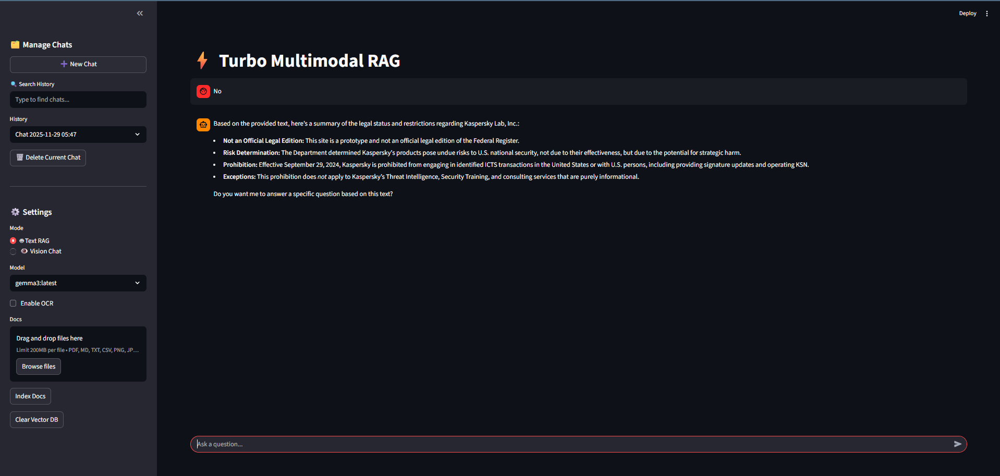

# RAG_App
# ⚡ Turbo Multimodal RAG

A local, containerized AI assistant capable of **Multimodal Reasoning**. It allows you to chat with your documents (PDF, MD, TXT) using RAG (Retrieval Augmented Generation) and analyze images using Vision Language Models, all running locally on your machine via Docker and Ollama.

---
## Look of App:




## 🚀 What Can Be Accomplished?

### 1. 🤖 Text RAG (Document Chat)
* **Ingest Complex Documents:** Uses [Docling](https://github.com/DS4SD/docling) to parse PDFs. It supports standard digital PDFs and includes an **OCR Toggle** for scanned documents/receipts.
* **Parallel Processing:** Ingests multiple files simultaneously using multi-threading to speed up the embedding process.
* **Deep Reasoning:** Uses **Gemma 3:4b (lastest)** to answer complex questions based *only* on the context provided in your documents.
* **Source Citations:** Every answer cites the source document filename.

### 2. 👁️ Vision Chat (Image Analysis)
* **True Multimodal Vision:** Uses **Gemma 3:4b (lastest)**  to "look" at uploaded images.
* **Visual Q&A:** Upload charts, diagrams, screenshots, or handwritten notes and ask the AI to explain them, extract data, or transcribe text.

### 3. ⚡ Efficient Architecture
* **Cached Resources:** Database connections and heavy models are cached to prevent reloading on every interaction.
* **Persistent Storage:** Your Vector Database (`vector_database.db`) is saved to your local disk, so you don't lose your knowledge base when you restart Docker.

---

## 🛠️ How to Run

### Prerequisites
* **Docker and Docker compose** installed and running.
* *(Optional)* NVIDIA GPU with updated drivers (for faster performance).
  
  **Comment out in docker-compose.yml if no GPU or Running on MAC**
  ```
  deploy:
    resources:
      reservations:
        devices:
          - driver: nvidia
            count: 1
            capabilities: [gpu]
  ```

### Step 1: Project Setup
```git clone https://github.com/QuasarFlash/RAG_App.git```

Ensure your folder structure resembles this:
```text
.
├── app.py                 # The Streamlit Application
├── docker-compose.yml     # Orchestration
├── Dockerfile             # App environment definition
├── entrypoint.sh          # Startup script
└── requirements.txt       # Python dependencies
```
### Step 2: Project Setup
```docker compuse up --build```
### Step 3: Open App in Browser
#### http://localhost:8501

